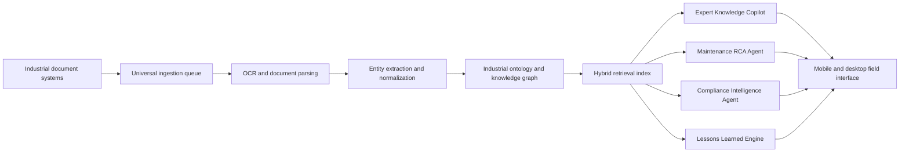

# AssetIQ Brain Architecture

## Prototype Scope

AssetIQ Brain demonstrates the core hackathon idea without requiring private plant data or cloud keys:

- Ingests representative industrial document types: P&ID, CMMS work order, OEM manual, inspection report, SOP, and regulatory checklist.
- Extracts entities such as equipment tags, process instruments, failure modes, regulatory requirements, procedures, and maintenance observations.
- Links extracted facts into a plant knowledge graph.
- Answers operational questions using cited evidence and confidence scores.
- Generates RCA recommendations, compliance gap flags, and field-ready actions.

## Production Architecture

1. Document connectors pull from engineering vaults, CMMS, QMS, email archives, SharePoint, scanned forms, and historian exports.
2. OCR and layout models extract text, tables, stamps, handwritten fields, and P&ID callouts.
3. Industrial NER normalizes tags, units, asset hierarchy, dates, people, documents, and regulatory references.
4. Knowledge graph stores relationships between assets, events, work orders, procedures, inspections, hazards, and evidence.
5. Hybrid search combines vector retrieval, keyword search, metadata filters, and graph traversal.
6. Agent layer handles copilot answers, RCA, maintenance planning, compliance evidence packaging, and lessons learned.
7. Field UX exposes the same intelligence on mobile, tablets, control rooms, and engineering desktops.

## Evaluation Mapping

- Entity extraction accuracy: compare extracted tags and requirements against labeled industrial samples.
- Query answer quality: benchmark answers for maintenance, safety, engineering, and compliance questions.
- Graph linkage completeness: score how many cross-document relationships are correctly recovered.
- Time-to-answer: compare against manual search across disconnected systems.
- Compliance gap detection: validate missing evidence and outdated procedure flags against audit packs.
